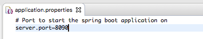

# API Documentation

This task is designed to automatically generate the API documentation for the application we created in [Spring Boot REST](Spring_Boot_REST). To do that, you will use [Swagger](https://swagger.io/). This tool allows the automatic generation of your API documentation, which can be distributed to customers and also allows you to test your endpoints.

## Task

You can follow a tutorial here: <http://www.baeldung.com/swagger-2-documentation-for-spring-rest-api>. **Please complete only steps 1-5**. Other steps cover more advanced topics and are not required. 


The task is to add swagger to your Java application. When complete, you should be able to browse to the `/swagger-ui/` end-point which should contains the api documentation for your project "GET /helloWorld" end-point.

* You will need to add the "springfox-swagger2" and "springfox-swagger-ui" dependencies to your project and setup a configuration of which endpoints to document.
* You should also create or modify an "application.properties" file to setup your application to run on a specified port (not 8080).




* Successful running of the Swagger documentation:


## Notes

### 1. `NullPointerException` when using v3 of the SpringFox library

Following above tutorial, when using v3.0.0 of the SpringFox you might have a NullPointerException

```bash
org.springframework.context.ApplicationContextException: Failed to start bean 'documentationPluginsBootstrapper'; nested exception is java.lang.NullPointerException
```

To fix it you need to add a bellow setting to the `application.properties' file:

```
spring.mvc.pathmatch.matching-strategy = ANT_PATH_MATCHER
```

More information about the bug: [https://stackoverflow.com/a/70037507/1779488](https://stackoverflow.com/a/70037507/1779488)

