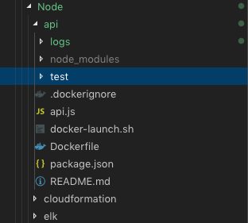

# Testing

Testing is vital to ensure the quality of our code but also to allow refactoring of our code without fear. The purpose of this task is to create unit and integration tests for the Node.js applciation.

Firstly, I **highly recommend reading** the following article which is an excellent summary of the different type of testing called the [Practical Test Pyramid](https://martinfowler.com/articles/practical-test-pyramid.html).

## Task

### Prerequisites

Node.js testing framework of your choice, I would recommend Mocha as it is easy to use and there are plenty of examples out there for you to reference.

Mocha is a great testing tool that can be used to write integration and unit tests for Node.js applications. The following link should provide you with some help with this: <https://www.toptal.com/nodejs/integration-and-e2e-tests-nodejs-mongodb>

### Steps

The following test types should be created:

* Unit tests - testing each of the methods
* Integration tests - testing each of the RESTful endpoints end-to-end (currently GET /helloWorld).

Your tests should be held within a separate folder:

which will allow tools which monitor the code coverage of the tests to ignore the tests themselves. You should download the [SonarQube plugin](https://www.sonarqube.org) to ensure that the tests you have written cover all of the code - SonarQube is not required as part of this task, however would recommend that you do some reading up about it and potentially include it as part of this introduction if you have the time.
