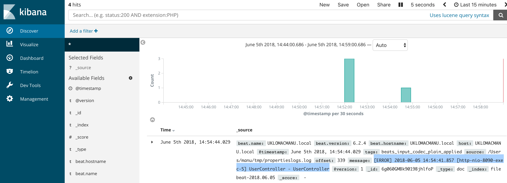

# Advanced Logging

This task will involve setting up the [ELK stack](https://www.elastic.co/products) and monitoring log files using Kibana.

## Udemy

[Complete Elasticsearch Masterclass](https://capco.udemy.com/course/complete-elasticsearch-masterclass-with-kibana-and-logstash)

## Task

The task is to run the ELK stack using a docker container, to forward to the logs from the java application to ELK and to view them in the Kibana website. You can follow a tutorial [here](https://elk-docker.readthedocs.io).

* Start by ensuring that the ELK stack is running.
* Manually add log entries to the stack and ensure they can be viewed in Kibana.
* Forward the log files from your application to Logstash using e.g. Filebeats
* Check that your application automatically generates log files in Kibana.

## Tips

### Setting up ELK Stack

Docker has a default setting which limits the memory resource available to the Docker Engine to 2GiB. In order to complete the following steps you will need at least 4GiB of memory allocated to Docker. To change this go to Docker -> Preferences -> Advanced -> Memory 4GiB.

To run ELK stack on a Mac, you will need to build the image for the ARM64 architecture. You can do this by cloning the elk-docker source files from the [Git repository](https://github.com/spujadas/elk-docker).

Enter the directory containing the source files and run the following command to build ELK stack for ARM64:

```shell
docker build -t elk-arm64 --build-arg IMAGE=master-arm64 --build-arg ARCH=aarch64 .
```

You can run ELK stack by then executing the following command:

```shell
docker run -p 5601:5601 -p 9200:9200 -p 5044:5044 -it --name elk elk-arm64
```

Check that you can view the Kibana page on your local server [here](http://localhost:5601).


In a separate terminal, find the name of your ELK docker container using `docker ps`.

Then start a bash session on that container ("elk" is the docker name of my container):

```shell
docker exec -it elk /bin/bash

/opt/logstash/bin/logstash --path.data /tmp/logstash/data -e 'input { stdin { } } output { elasticsearch { hosts => ["localhost"] } }'
```

Wait for the logstash prompt to load, then what you type will be automatically sent to logstash from the Standard Input of the terminal.

Got to the Kibana webpage and the Management Console. Add a new index of "\*" with the timestamp and then choose the "Discover" option to see what you typed in the terminal.




### Adding a local Filebeats setup to forward logs automatically

Install a local installation of filebeats.

Copy the logstash certificate to a local file: <https://github.com/spujadas/elk-docker/blob/master/logstash-beats.crt>

Create a `filebeat.yml` file within your filebeats folder:

```yaml

    output:
        logstash:
            enabled: true
            hosts:
                - localhost:5044
            ssl:
                certificate_authorities:
                    - /Users/manu/filebeat-6.2.4-darwin-x86_64/logstash-beats.crt
                timeout: 15
        filebeat:
            prospectors:
                paths:
                    - /Users/manu/tmp/*.log
            document_type: syslog
```

Modify the paths to the certificate and the log file to match your own setting.

Run filebeats with `./filebeat -e -c filebeat.yml`.  View your log files in Kibana (you may need to add a new index pattern


